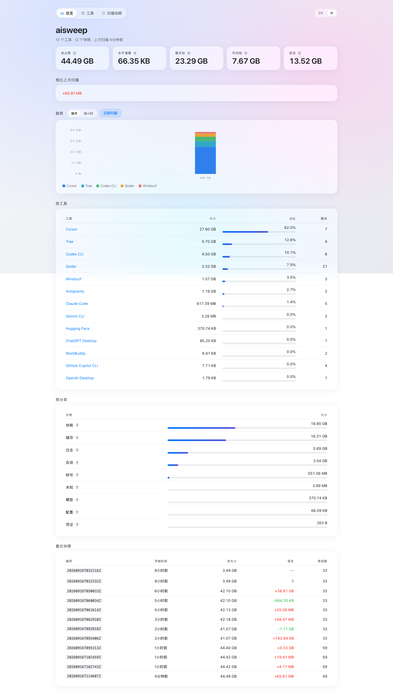
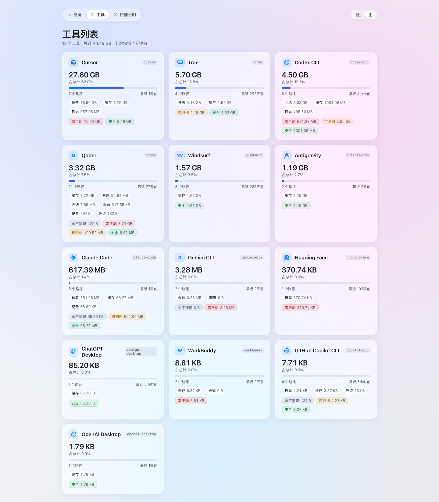
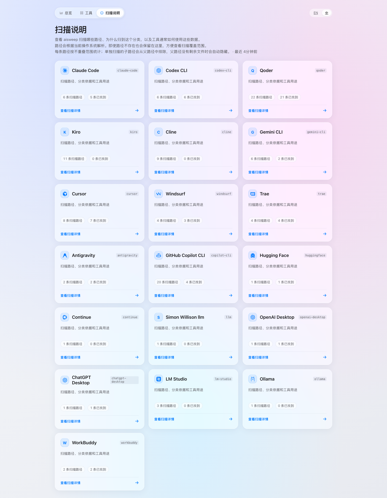

# AICensus

本地 AI 工具存储普查与趋势监控。

现在的 AI CLI 和桌面应用越来越多：会话、快照、缓存、日志、模型和配置
散落在不同目录里，很难知道空间到底被谁占用，也很难判断它是否持续增长。
AICensus 只读扫描这些本地数据，按工具和类别整理结果，并在浏览器里展示趋势。

> 当前可执行文件仍然叫 `aisweep`，这样可以兼容已有的命令、环境变量和快照数据。

[English README](README.en.md) · [GitHub Actions](https://github.com/wuyouMaster/aicensus/actions)

## 当前能力

- **总览**：查看总占用、风险分布、按工具和按类别的空间分布，以及历史快照。
- **趋势**：支持按天和按小时切换，柱状图支持 hover 查看具体时间点的数据。
- **工具列表**：每个 AI 工具独立显示图标、空间占用、类别分布和最近扫描时间。
- **扫描说明**：逐个工具解释扫描了哪些路径、为什么归入该类别，以及工具通常如何使用这些数据。
- **跨平台**：支持 macOS、Windows 和 Linux。
- **只读设计**：第一阶段只统计和展示，不删除文件；清理计划放到第二阶段。
- **本地优先**：默认只监听 `127.0.0.1`，不需要数据库，不上传遥测数据。
- **重复路径处理**：父目录完全由已注册的子目录覆盖时，只展示子目录结果，避免空间重复计算。

## 页面预览

下面的截图来自本地运行中的页面，截图内容只包含网页本身，不包含浏览器地址栏、收藏夹或其他浏览器界面。

### 总览



### 工具列表



### 扫描说明



## 快速开始

需要 Go 1.22 或更高版本。

```bash
go build -o bin/aisweep ./cmd/aisweep
./bin/aisweep serve --interval=1h
```

启动后打开 <http://127.0.0.1:7890>。也可以在总览页面点击“立即扫描”进行一次即时扫描。

常用命令：

```bash
aisweep scan                         # 扫描一次并写入快照
aisweep serve                        # 启动本地 Web 面板
aisweep path                         # 查看当前生效的工具路径注册表
aisweep doctor                       # 检查当前机器上哪些路径存在
aisweep serve --port 7890            # 修改监听端口
aisweep serve --host 127.0.0.1       # 修改监听地址
aisweep serve --interval=1h          # 每小时后台扫描一次
aisweep serve --scan=false            # 启动时跳过首次扫描
```

快照目录可以通过 `AISWEEP_DATA` 覆盖：

```bash
AISWEEP_DATA=/path/to/snapshots aisweep serve
```

## 支持的平台

源码扫描器会根据当前平台解析路径：

| 平台 | 配置目录 | 数据目录 | 快照目录 |
| --- | --- | --- | --- |
| macOS | `~/.config/aisweep` | `~/.local/share/aisweep` | `~/.local/share/aisweep/snapshots` |
| Linux | `$XDG_CONFIG_HOME/aisweep` 或 `~/.config/aisweep` | `$XDG_DATA_HOME/aisweep` 或 `~/.local/share/aisweep` | 同数据目录下的 `snapshots` |
| Windows | `%APPDATA%\\aisweep` | `%LOCALAPPDATA%\\aisweep` | 同数据目录下的 `snapshots` |

GitHub Actions 会在 Ubuntu、macOS 和 Windows 上运行测试与静态检查，并构建以下目标：

- macOS：amd64、arm64
- Linux：amd64、arm64
- Windows：amd64、arm64

## 扫描器架构

每个 AI 工具都可以实现独立的 `registry.ToolScanner`：

```go
type ToolScanner interface {
    Definition() registry.Tool
    Discover() ([]registry.Entry, error)
}
```

`Definition` 提供工具元数据和默认路径，`Discover` 负责根据当前机器动态发现实际路径。
通用的文件遍历和统计逻辑位于 `internal/scanner`，新增工具时只需要在
`internal/registry` 增加具体实现、注册扫描器，并补充测试或说明。

内置路径使用 `platform_paths` 声明 `darwin`、`windows` 和 `linux` 配置，路径模板支持：
`{home}`、`{config}`、`{data}`、`{cache}`、`{state}`。旧的 `macos_paths` 配置仍然兼容。

当前已覆盖 Claude Code、Codex CLI、Qoder、Kiro、Cline、Gemini CLI、Cursor、Windsurf、
TRAE、Antigravity、GitHub Copilot CLI、Hugging Face、Continue、llm、OpenAI Desktop、
ChatGPT Desktop、LM Studio、Ollama 和 WorkBuddy。

## 分类与数据

每条扫描路径都会标记类别和风险等级：

- 类别：缓存、快照、会话、日志、转写、模型、配置、凭证或未知。
- 风险：安全、可归档、需手动确认或永不清理。

注册表覆盖文件位于：

- macOS：`~/.config/aisweep/registry.yaml`
- Linux：`$XDG_CONFIG_HOME/aisweep/registry.yaml` 或 `~/.config/aisweep/registry.yaml`
- Windows：`%APPDATA%\\aisweep\\registry.yaml`

覆盖配置会合并到内置注册表之上，以工具 `id` 匹配；非空字段优先，新工具会追加。
快照是数据目录下的 JSON 文件，没有数据库，也没有遥测上报。

## 开发

```bash
go test ./...
go vet ./...
go build -o bin/aisweep ./cmd/aisweep
```

交叉编译示例：

```bash
GOOS=darwin  GOARCH=arm64 go build -o bin/aisweep-darwin-arm64 ./cmd/aisweep
GOOS=linux   GOARCH=amd64 go build -o bin/aisweep-linux-amd64 ./cmd/aisweep
GOOS=windows GOARCH=amd64 go build -o bin/aisweep-windows-amd64.exe ./cmd/aisweep
```

欢迎为新的 AI 工具补充扫描器、路径说明、平台适配和测试。提交前请运行 `go test ./...`
与 `go vet ./...`。

## 规划

第二阶段再考虑清理能力：先提供 dry-run 预览，再按照类别和风险等级选择性归档，
并要求清理注册表明确授权后才执行。
